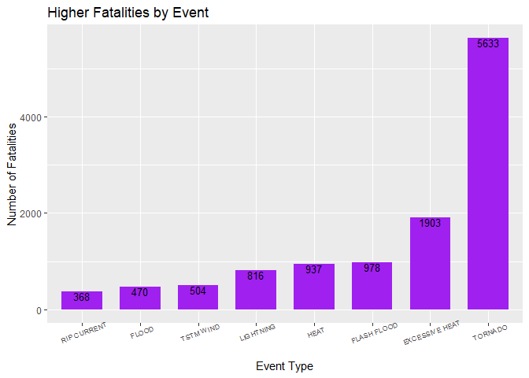
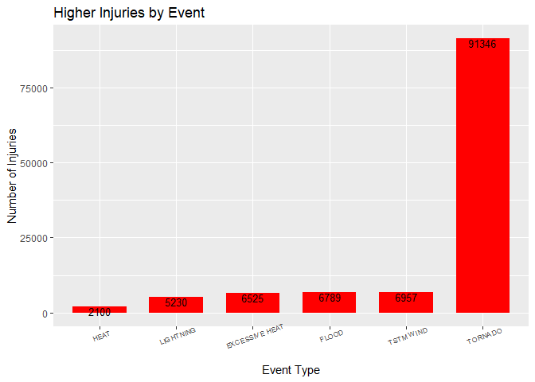
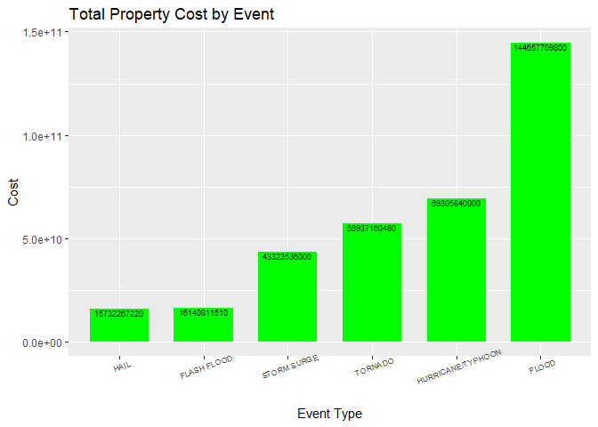
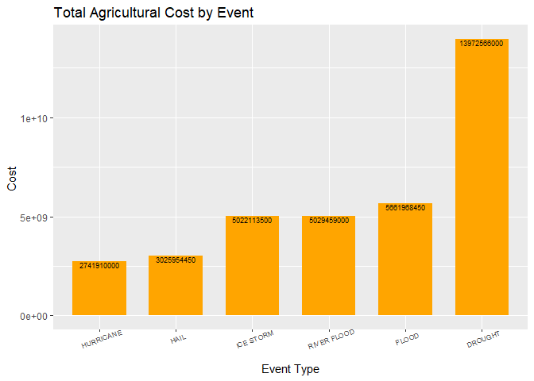

```r
knitr::opts_chunk$set(echo = TRUE)
## R Markdown
```

1 Synopsis

The following analysis uses the U.S. National Oceanic and Atmospheric Administration's (NOAA) storm database.The goal is showing which weather events have effects in the human health and the property and agricultural economic consequences they cause . To reach that conclusion the analysis has been made based on the variables represented  fatalities, injuries, and property and crop damage.

2 Data Processing

The data has been downloaded directly from the Stormdata link provided for the project .The ORIGINAL file is in csv format and compress in bz2. 
The packages used for the analysis are the following


```r
library(ggplot2)
library(dplyr)
```

```
## 
## Attaching package: 'dplyr'
```

```
## The following objects are masked from 'package:stats':
## 
##     filter, lag
```

```
## The following objects are masked from 'package:base':
## 
##     intersect, setdiff, setequal, union
```

Downloading the data


```r
temp1 <- tempfile()
download.file("https://d396qusza40orc.cloudfront.net/repdata%2Fdata%2FStormData.csv.bz2",
              temp1)
storme<- read.csv(temp1)
unlink(temp1)
```

The variables for the analysis are only related to the event type , human health and economic effect, it means : EVTYPE, FATALITIES, INJURIES,PROPDMG, PROPDMGEXP, CROPDMG and CROPDMGEXP


```r
# select only the columns we need for the project
storme1<-select(storme,EVTYPE, FATALITIES, INJURIES,
                PROPDMG, PROPDMGEXP, CROPDMG, CROPDMGEXP)
```

3 Population Health Analysis

The health analysis has been made using the variables of Fatalities and Injuries, as direct effect in humans caused by weather events


```r
stmg1<-group_by(storme1,EVTYPE)%>%summarize(fata=sum(FATALITIES), inju=sum(INJURIES))
```

3.1 Results 

After getting the total of fatalities and injuries per event, the "0" amount is eliminated from the data frame 


```r
faorder<-filter(arrange(stmg1,desc(fata)),fata!=0)
inaorder<-filter(arrange(stmg1,desc(inju)),inju!=0)
```

The first eight events with more fatalities are


```r
head(faorder,8) 
```

```
## # A tibble: 8 x 3
##   EVTYPE          fata  inju
##   <fct>          <dbl> <dbl>
## 1 TORNADO         5633 91346
## 2 EXCESSIVE HEAT  1903  6525
## 3 FLASH FLOOD      978  1777
## 4 HEAT             937  2100
## 5 LIGHTNING        816  5230
## 6 TSTM WIND        504  6957
## 7 FLOOD            470  6789
## 8 RIP CURRENT      368   232
```

The first eight events with more injuries are


```r
head(inaorder,8)
```

```
## # A tibble: 8 x 3
##   EVTYPE          fata  inju
##   <fct>          <dbl> <dbl>
## 1 TORNADO         5633 91346
## 2 TSTM WIND        504  6957
## 3 FLOOD            470  6789
## 4 EXCESSIVE HEAT  1903  6525
## 5 LIGHTNING        816  5230
## 6 HEAT             937  2100
## 7 ICE STORM         89  1975
## 8 FLASH FLOOD      978  1777
```

The graphics below show the 8 events with more fatalities and injuries


```r
gr1<-ggplot(head(faorder,8),aes(x=reorder(EVTYPE,fata),y=fata))
gr1a<-gr1+geom_bar(stat="identity",fill="purple",width = .7)+
labs(x="Event Type",y="Number of Fatalities",title = "Higher Fatalities by Event")+
geom_text(aes(label=fata,vjust=1),size=3.5)+
theme(axis.text.x=element_text(angle=20, hjust=.5, size =7))
gr1a
```

<!-- -->

```r
gr2<-ggplot(head(inaorder),aes(x=reorder(EVTYPE,inju),y=inju))
gr2a<-gr2+geom_bar(stat="identity",fill="red",width = .7)+
labs(x="Event Type",y="Number of Injuries",title = "Higher Injuries by Event")+
geom_text(aes(label=inju,vjust=1),size=3.5)+
theme(axis.text.x=element_text(angle=20, hjust=.5, size =7))
gr2a
```

<!-- -->

4 Economy effects

The analysis of the economic effects is done using 4 variables , PROPDMG and PROPDMGEXP show the property damages and CROPDMG and CROPDMGEXP show agricultural damages.
The amounts are represented by characters:"H","h","k","K","m","M","b","B", those elements are selected (other elements are eliminated of the data frame)and changed to their numeric values


```r
cost1<-filter(storme1,PROPDMGEXP%in%c("H","h","k","K","m","M","b","B"))
cost2<-filter(storme1,CROPDMGEXP%in%c("H","h","k","K","m","M","b","B"))

cnumber<-function(m1){
      m1<-gsub("h",100,m1 ,ignore.case=T)
m1<-gsub("k",1000,m1 ,ignore.case=T)
m1<-gsub("m",1000000,m1,ignore.case=T)
m1<-gsub("b",1000000000,m1,ignore.case=T)
}
cost2$CROPDMGEXP<-cnumber(cost2$CROPDMGEXP)
cost1$PROPDMGEXP<-cnumber(cost1$PROPDMGEXP)
```

The total cost per event is obtained multiplying the variables PROPDMG and PROPDMGEXP for Property damage in the cost1 data frame.For agricultural damages CROPDMG and CROPDMGEXP are multiplied in cost2 data frame


```r
cost1a<-group_by(cost1,EVTYPE)%>%summarize(costo=sum(as.numeric(PROPDMGEXP)*PROPDMG))
cost2a<-group_by(cost2,EVTYPE)%>%summarize(costo2=sum(as.numeric(CROPDMGEXP)*CROPDMG))                                    

cost1a<-arrange(cost1a,desc(costo))
cost2a<-arrange(cost2a,desc(costo2))
```
4.1 Results

The 6 more costly property damages events are


```r
head(cost1a)
```

```
## # A tibble: 6 x 2
##   EVTYPE                   costo
##   <fct>                    <dbl>
## 1 FLOOD             144657709800
## 2 HURRICANE/TYPHOON  69305840000
## 3 TORNADO            56937160480
## 4 STORM SURGE        43323536000
## 5 FLASH FLOOD        16140811510
## 6 HAIL               15732267220
```

The 6 more costly agricultural damages events are


```r
head(cost2a)
```

```
## # A tibble: 6 x 2
##   EVTYPE           costo2
##   <fct>             <dbl>
## 1 DROUGHT     13972566000
## 2 FLOOD        5661968450
## 3 RIVER FLOOD  5029459000
## 4 ICE STORM    5022113500
## 5 HAIL         3025954450
## 6 HURRICANE    2741910000
```

The graphics below show six more costly  events for properties and agricultural damages


```r
gr3<-ggplot(head(cost1a),aes(x=reorder(EVTYPE,costo),y=costo))
gr3a<-gr3+geom_bar(stat="identity",fill="green",width = .7)+
      labs(x="Event Type",y="Cost",title = "Total Property Cost by Event")+
      geom_text(aes(label=costo,vjust=1),size=2.5)+
      theme(axis.text.x=element_text(angle=20, hjust=.5, size =7))
gr3a
```

<!-- -->

```r
gr4<-ggplot(head(cost2a),aes(x=reorder(EVTYPE,costo2),y=costo2))
gr4a<-gr4+geom_bar(stat="identity",fill="orange",width = .7)+
      labs(x="Event Type",y="Cost ",title = "Total Agricultural Cost by Event")+
      geom_text(aes(label=costo2,vjust=1),size=2.5)+
      theme(axis.text.x=element_text(angle=20, hjust=.5, size =7))
gr4a
```

<!-- -->

